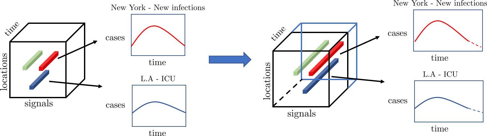

# STELAR: Spatio-temporal Tensor Factorization with Latent Epidemiological Regularization



This is the implementation of the following paper \
[STELAR: Spatio-temporal Tensor Factorization with Latent Epidemiological Regularization](https://arxiv.org/abs/2012.04747) \
Nikos Kargas, Cheng Qian, Nicholas D. Sidiropoulos, Cao Xiao, Lucas M. Glass, Jimeng Sun \
AAAI 2021.


### Abstract
Accurate prediction of the transmission of epidemic diseases such as COVID-19 is crucial for implementing effective mitigation measures. In this work, we develop a tensor method to predict the evolution of epidemic trends for many regions simultaneously. We construct a 3-way spatio-temporal tensor (location, attribute, time) of case counts and propose a nonnegative tensor factorization with latent epidemiological model regularization named STELAR. Unlike standard tensor factorization methods which cannot predict slabs ahead, STELAR enables long-term prediction by incorporating latent temporal regularization through a system of discrete-time difference equations of a widely adopted epidemiological model. We use latent instead of location/attribute-level epidemiological dynamics to capture common epidemic profile sub-types and improve collaborative learning and prediction. We conduct experiments using both county- and state-level COVID-19 data and show that our model can identify interesting latent patterns of the epidemic. Finally, we evaluate the predictive ability of our method and show superior performance compared to the baselines, achieving up to 21% lower root mean square error and 25% lower mean absolute error for county-level prediction.

If you find this code useful for your research, please cite our paper:

```
@inproceedings{kargasAAAI2021,
  title={{STELAR}: Spatio-temporal Tensor Factorization with Latent Epidemiological Regularization},
  author={Kargas, Nikos and Qian, Cheng and Sidiropoulos, Nicholas D and Xiao, Cao and Glass, Lucas M and Sun, Jimeng},
  journal={AAAI},
  year={2021}
}
```